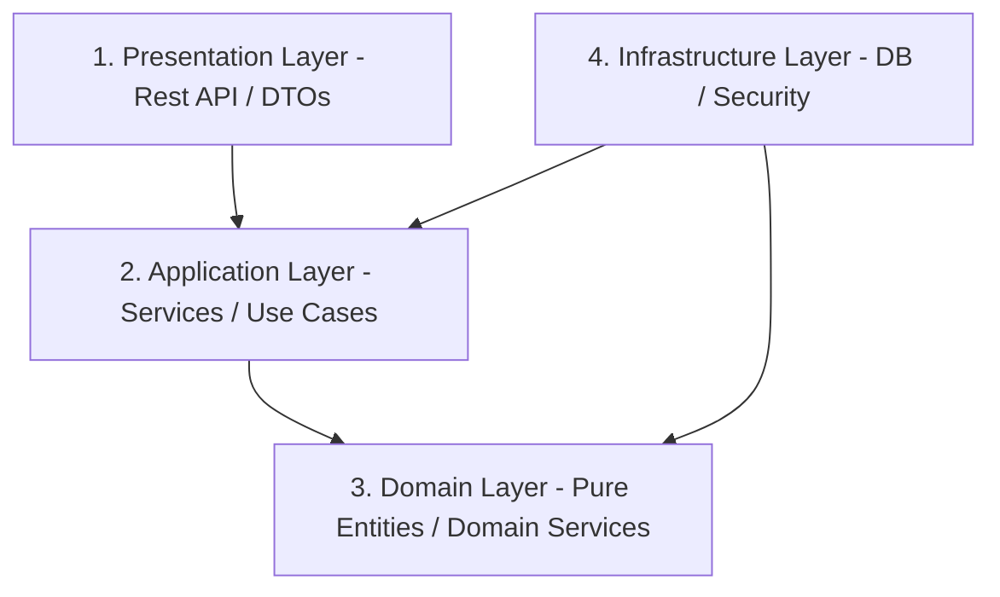

# ☕ BACKEND CLEAN ARCHITECTURE SPECIFICATION

Tài liệu này đặc tả chi tiết kiến trúc phân lớp sạch (Clean Architecture) và cách tổ chức các gói nghiệp vụ (Modular Monolith) phía **Backend Spring Boot 3.x** của dự án **MiniFaceBook**.

---

## 🏗️ 1. Nguyên tắc Kiến trúc Cốt lõi (The Dependency Rule)

Hệ thống áp dụng nghiêm ngặt triết lý **Clean Architecture** của Robert C. Martin (Uncle Bob). Điểm cốt lõi là **Quy tắc Phụ thuộc**: các lớp bên trong KHÔNG ĐƯỢC PHÉP biết bất kỳ thông tin nào về các lớp bên ngoài. Sự phụ thuộc luôn hướng vào trung tâm (Domain Core).



---

## 📁 2. Cấu trúc Gói Nghiệp vụ (Modular Monolith Package Structure)

Mỗi module nghiệp vụ lớn (như `auth`, `user`, `chat`, `social`) được cô lập khép kín trong gói riêng của mình dưới thư mục `com.minifacebook.module`. Các thành phần hạ tầng dùng chung nằm tại `com.minifacebook.shared`.

```text
backend/src/main/java/com/minifacebook/
├── module/
│   ├── auth/                      # Module Xác thực và Phiên đăng nhập
│   │   ├── presentation/          # REST Controllers, DTOs (Request/Response)
│   │   ├── application/           # Service Interfaces & Implementations (Use Cases)
│   │   ├── domain/                # Pure Entity (User), Repository Interfaces, Domain Service
│   │   └── infrastructure/        # MongoDB Adapters, JWT Security Config, Resend Email Adapter
│   └── user/                      # Module Quản lý Hồ sơ & Người dùng
│       ├── presentation/
│       ├── application/
│       ├── domain/
│       └── infrastructure/
└── shared/                        # Các thành phần dùng chung (Cross-cutting Concerns)
    ├── domain/                    # Interfaces dùng chung (ví dụ: MediaService)
    ├── infrastructure/            # Thư viện dùng chung (ví dụ: CloudinaryService, Apache Tika)
    └── exception/                 # Global Exception Handling
```

---

## 🛡️ 3. Chi tiết Đặc tả Bốn Phân Lớp (Layer Specifications)

### A. Presentation Layer (Tầng Giao Diện REST)
*   **Nhiệm vụ:** Tiếp nhận HTTP Request, xử lý xác thực đầu vào sơ bộ bằng JSR-380, gọi tầng Application để thực thi nghiệp vụ, và trả về HTTP Response chuẩn (JSON / Swagger OpenAPI).
*   **Quy tắc:**
    *   Sử dụng `@RestController` và cấu hình phân quyền `@PreAuthorize` nếu cần.
    *   Chuyển đổi dữ liệu từ HTTP Payload vào các đối tượng DTOs (Data Transfer Objects).
    *   **Bắt buộc** sử dụng thư viện `@Valid` để kiểm duyệt dữ liệu nhập (ví dụ: `@NotBlank`, `@Email`, `@Size`).
    *   Tuyệt đối không để lộ cấu trúc bảng dữ liệu (Entities) ra ngoài API.

### B. Application Layer (Tầng Logic Ứng Dụng)
*   **Nhiệm vụ:** Hiện thực hóa các kịch bản nghiệp vụ (Use Cases). Điều phối dữ liệu từ Repository, thực hiện các tính toán trung gian và cập nhật trạng thái hệ thống.
*   **Quy tắc:**
    *   Các Service trong tầng này phải được chú thích `@Service` và `@Transactional` của Spring.
    *   Chỉ tương tác với tầng Domain và gọi các interface của tầng Infrastructure thông qua Dependency Injection.

### C. Domain Layer (Tầng Nghiệp Vụ Cốt Lõi)
*   **Nhiệm vụ:** Chứa các quy tắc nghiệp vụ cốt lõi của doanh nghiệp (Enterprise Business Rules). Đây là phần quan trọng nhất, độc lập hoàn toàn với tất cả các framework bên ngoài.
*   **Quy tắc:**
    *   Các Entity trong phân lớp này phải là các class Java thuần túy (POJO), **TUYỆT ĐỐI CẤM** import bất kỳ annotation nào của MongoDB (`@Document`), JPA (`@Entity`) hay Spring Framework.
    *   Các interface Repository (ví dụ: `UserRepository`) được khai báo ở đây để tầng Application gọi, nhưng sẽ được hiện thực hóa ở tầng Infrastructure.

### D. Infrastructure Layer (Tầng Hạ Tầng Kỹ Thuật)
*   **Nhiệm vụ:** Hiện thực hóa tất cả các kết nối kỹ thuật chi tiết như lưu trữ database (MongoDB), cấu hình Spring Security (JWT Filter), và gọi dịch vụ bên thứ ba (Resend API, Cloudinary).
*   **Quy tắc:**
    *   Các class truy cập DB (`UserRepositoryImpl`) sẽ implement interface ở tầng Domain, thực hiện mapping Domain Entity sang Database Document (`UserDocument` cho MongoDB) và lưu xuống DB.
    *   Cơ chế mapping phải sử dụng **MapStruct** hiệu năng cao để giảm thiểu boilerplate code.

---

## 🛠️ 4. Quy chuẩn Viết Code & Công cụ Tối ưu Hóa

### A. Quy chuẩn Lombok (Tránh bẫy Circular Hash/Equals)
*   Sử dụng `@Getter` và `@Setter` riêng biệt cho các trường dữ liệu.
*   Sử dụng `@RequiredArgsConstructor` thay cho việc tự viết Constructor tiêm phụ thuộc.
*   **TUYỆT ĐỐI KHÔNG** sử dụng `@Data` trên các Entity liên quan đến DB, vì nó tự động sinh phương thức `hashCode()` và `equals()` quét qua tất cả các liên kết quan hệ, gây ra lỗi **Tràn bộ nhớ (StackOverflowError)** do vòng lặp vô hạn.

### B. MapStruct Spec
Cấu hình MapStruct luôn sử dụng chiến lược Spring Component Model để tự động tiêm đối tượng mapper qua Spring Context:
```java
@Mapper(componentModel = "spring")
public interface UserMapper {
    User toDomain(UserDocument document);
    UserDocument toDocument(User domain);
    UserResponse toResponse(User domain);
}
```

---

## 🚦 5. Kiểm thử Tự động Bảo vệ Kiến trúc (ArchUnit Gatekeeper)

Để ranh giới kiến trúc Clean Architecture không bao giờ bị phá vỡ bởi sai sót vô tình của lập trình viên, hệ thống tích hợp bộ test kiểm thử tự động **ArchUnit** chạy trực tiếp trong giai đoạn kiểm thử đơn vị (Unit Test).

```java
@AnalyzeClasses(packages = "com.minifacebook")
public class CleanArchitectureTest {

    @ArchTest
    public static final ArchRule domain_should_not_depend_on_other_layers =
        noClasses()
            .that()
            .resideInAPackage("..domain..")
            .should()
            .dependOnClassesThat()
            .resideInAPackage("..presentation..")
            .orShould()
            .dependOnClassesThat()
            .resideInAPackage("..infrastructure..");
            
    @ArchTest
    public static final ArchRule application_should_only_depend_on_domain =
        classes()
            .that()
            .resideInAPackage("..application..")
            .should()
            .onlyDependOnClassesThat()
            .resideInAnyPackage("..domain..", "..application..", "java..", "org.slf4j..");
}
```
*   **Hiệu quả:** Bất kỳ pull request nào chứa dòng code vi phạm quy tắc kiến trúc sẽ ngay lập tức làm sập bản build thử nghiệm tại Local/CI-CD, bảo vệ dự án khỏi nợ kỹ thuật (Tech Debt) vĩnh viễn.
