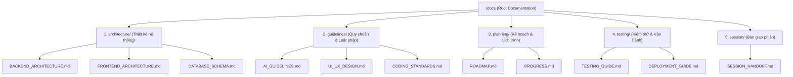

# 🏛️ ENTERPRISE DOCUMENTATION STANDARDS & AI GOVERNANCE

> [!NOTE]
> **ĐỀ ÁN ĐƯỢC THIẾT KẾ BỞI SENIOR SYSTEM ARCHITECT (10+ YEARS EXPERIENCE)**
> Tài liệu này trình bày phương án cải tiến toàn diện cách thức tổ chức tài liệu và thiết lập các điều luật tối cao nhằm kiểm soát, định hướng cho các AI Agent vận hành trong dự án MiniFaceBook một cách kỷ luật, an toàn và tối ưu nhất.

---

## 📁 1. KIẾN TRÚC THƯ MỤC TÀI LIỆU MỚI (DOCUMENTATION DIRECTORY ARCHITECTURE)

Đặt phẳng tất cả các tệp `.md` ở gốc thư mục `docs/` sẽ gây khó khăn cho việc tra cứu và dễ dẫn đến rủi ro AI ghi đè chéo thông tin. Đề xuất tái cấu trúc `/docs/` thành các phân vùng chuyên nghiệp theo sơ đồ sau:



### 📋 Chi tiết các phân vùng tài liệu:

| Phân vùng thư mục | Mục đích sử dụng | Lợi ích cho AI & Developer |
| :--- | :--- | :--- |
| 📁 **`docs/architecture/`** | Lưu trữ các thiết kế lõi: Sơ đồ lớp, quy định package, cơ chế map cơ sở dữ liệu MongoDB/Neo4j/Redis. | Giúp AI nắm rõ cấu trúc phân lớp Clean Architecture của dự án trước khi viết code mới. |
| 📁 **`docs/guidelines/`** | Tập hợp các quy tắc "luật pháp": Hiến pháp AI, cẩm nang thiết kế UI/UX, quy chuẩn định dạng code (Spotless/Checkstyle). | Là cẩm nang bắt buộc AI phải đọc và tuân thủ 100% khi phát triển giao diện hoặc logic. |
| 📁 **`docs/planning/`** | Quản lý tiến độ dự án: Lộ trình chi tiết (Roadmap), nhật ký phiên làm việc (Work Log) và lịch sử gỡ lỗi kỹ thuật. | Nơi duy nhất lưu trữ trạng thái lộ trình của dự án. Bảo vệ nghiêm ngặt chống ghi đè trái phép. |
| 📁 **`docs/testing/`** | Hướng dẫn kiểm thử và triển khai: Hướng dẫn viết Testcase (ArchUnit, JUnit 5, Playwright) và cấu hình CI/CD. | Đảm bảo AI luôn có thể tự động chạy test và xác minh chất lượng sản phẩm trước khi bàn giao. |
| 📁 **`docs/session/`** | Quản lý bàn giao giữa các phiên làm việc. | Tệp tin bàn giao ngắn gọn, súc tích để AI của phiên sau bắt nhịp ngay lập tức. |

---

## ⚖️ 2. CẢI TIẾN CÁCH VIẾT LUẬT CHO AI (AI GOVERNANCE EVOLUTION)

Để ngăn ngừa tối đa tình trạng AI tự ý sửa code hoặc ghi đè lộ trình ngoài ý muốn, chúng ta cần nâng cấp luật pháp quản trị AI (bổ sung trực tiếp vào `AI_GUIDELINES.md`) với 3 cơ chế kiểm soát tối tân sau:

### 🛡️ Cơ chế 1: "Git-Aware Verification" (Kiểm chứng Git trước khi bàn giao)
*   **Luật:** Trước khi kết thúc phiên làm việc (Session Handoff), AI bắt buộc phải chạy lệnh kiểm tra thay đổi thực tế trên Git (ví dụ: `git status` hoặc `git diff --stat`).
*   **Mục tiêu:** Phát hiện ngay lập tức các tệp tin bị sửa đổi ngoài ý muốn hoặc các dòng code rác sinh ra trong quá trình gỡ lỗi, đảm bảo repository bàn giao sạch 100%.

### 🛡️ Cơ chế 2: "Impact Analysis Matrix" (Bảng đánh giá tác động)
*   **Luật:** Đối với bất kỳ chỉnh sửa nào chạm vào tầng **Domain** hoặc lớp cấu hình lõi của **Infrastructure** (như Spring Security, Database Connection), AI phải trình bày một bảng đánh giá tác động ngắn trước khi viết code:
    ```markdown
    #### ⚠️ BẢNG ĐÁNH GIÁ TÁC ĐỘNG (IMPACT MATRIX)
    *   **Thành phần thay đổi:** [Tên lớp/Cấu hình]
    *   **Phạm vi ảnh hưởng:** [Các Use Cases / API bị tác động]
    *   **Rủi ro phá vỡ kiến trúc:** [Có ảnh hưởng đến ArchUnit test không? Nếu có, phương án xử lý là gì?]
    ```
*   **Mục tiêu:** Bắt buộc AI phải suy nghĩ thấu đáo và toàn diện về tính toàn vẹn hệ thống trước khi gõ phím.

### 🛡️ Cơ chế 3: "Roadmap Immutable Rule" (Quy tắc bất biến của Lộ trình)
*   **Luật:** Nghiêm cấm tuyệt đối việc thay đổi số hiệu Sprint, mục tiêu Sprint hoặc cấu trúc Phase trong tệp `ROADMAP.md` nếu chưa có yêu cầu bằng văn bản và có chữ ký đồng ý từ USER.
*   **Mục tiêu:** Bảo vệ lộ trình gốc đã thống nhất của dự án, tránh hiện tượng AI tự ý "quy hoạch lại lộ trình" để hợp thức hóa các công việc chưa hoàn thành.

---

## 🛠️ 3. KẾ HOẠCH TRIỂN KHAI DI CHUYỂN TÀI LIỆU (MIGRATION PLAN)

Để chuyển đổi sang hệ thống cấu trúc tài liệu mới một cách an toàn mà không làm mất lịch sử Git, chúng ta sẽ thực hiện theo 3 bước:
1.  **Bước 1:** Tạo các thư mục con trong `/docs/` (`architecture/`, `guidelines/`, `planning/`, `testing/`, `session/`).
2.  **Bước 2:** Di chuyển các tệp tài liệu hiện tại về đúng thư mục chức năng của chúng.
3.  **Bước 3:** Cập nhật lại toàn bộ các liên kết liên tệp (Cross-file Links) trong các file `.md` để tránh tình trạng link bị chết (Broken links).
